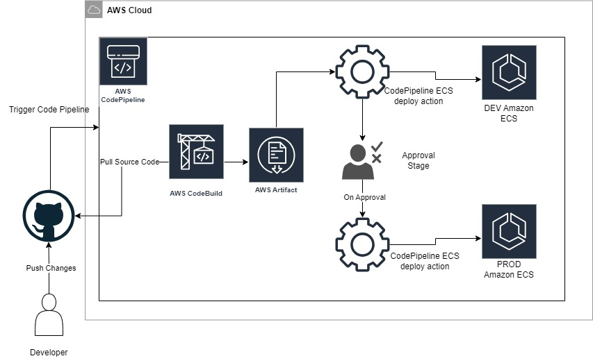

# e-commerce_business-registration-service

welcome to the ecom business registration service.
This service takes care of registration to the ecom platform.

## Implementation Details

This service has the following components:

1. FastAPI Service Deployed on Amazon ECS Fargate
2. A Customer Registration Database hosted on AWS RDS PostgreSQL

## Repository structure

Following is the structure of the repository :
```bash
.
├── Dockerfile
├── README.md
├── app
│   ├── __init__.py
│   ├── config
│   │   └── config.py
│   ├── functions.py
│   ├── main.py
│   └── utils
│       ├── db_connection.py
│       ├── secrets.py
│       └── sns.py
├── appspec.yml
├── buildspec.yml
├── compose.yaml
└── requirements.txt
```

### app
- This is the directory which hosts the real buiness logic of the application. 
- The [functions.py](https://github.com/sharayu-potuwar/e-commerce_business-registration-service/blob/main/app/functions.py) file contains all the necessary methods that are required for the service such as customer_registration and verify_registration.
- The [main.py](https://github.com/sharayu-potuwar/e-commerce_business-registration-service/blob/main/app/main.py) file contains the FastAPI endpoints that are exposed in the application. These endpoints in turn make a call to the functions defined in the functions.py.
- The [utils](https://github.com/sharayu-potuwar/e-commerce_business-registration-service/blob/main/app/functions.py) consists of all the reusable components such as database connation, fetching secret from AWS Secret Manager and sending message to SNS.
- The [config](https://github.com/sharayu-potuwar/e-commerce_business-registration-service/blob/main/app/functions.py) directory has the config file which ensures that proper config values are used when the application is executed in the DEV or PROD environment. Based on the environments there are three elements of the application that change with respect to the app, and hence they have been put into this config file -
  - DB_HOST
  - DB_SECRET
  - SNS_TOPIC_ARN

### CICD
- The application's deployment is fully automated with the CICD pipeline using:
  - docker - docker is used to build the image of the FastAPI application.
  - Amazon ECR - Once the image is built, the latest version is pushed to the ECR repository. Amazon ECS then pulls the image from this repository for the deployment. This process takes place in the Codepipeline.
  - AWS CodeBuild - This extracts the code from the GitHub repository when the pipeline is triggered. This also builds the image and publishes the image to ECR. The build process configuration is defined in [buildspec](https://github.com/sharayu-potuwar/e-commerce_business-registration-service/blob/main/buildspec.yml) file.
  - AWS CodePipeline - Codepipeline orchestrates the build and deploy process. This triggers automatically when there is a PR merged onto the main branch of this repository.
  - GitHub Repository

- CICD Pipeline Architecture - 




